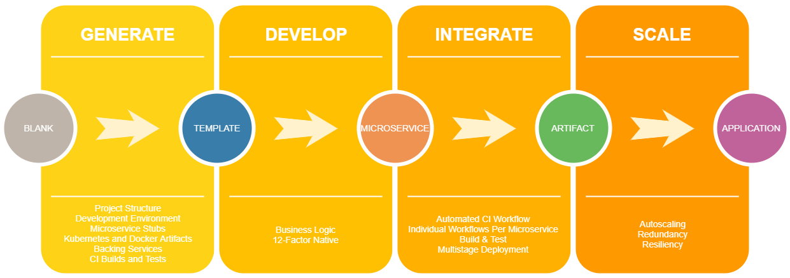

# [Weaver](https://github.com/jharrilim/weaver)

Microservices are hard to implement. There is a lot of upfront work that must be done to get the payoffs down the road. Writing Kubernetes artifacts, setting up CI for each service, and handling multi-stage deployments can be exhausting. Furthermore, these services will most likely be distributed across multiple teams which may choose to use different languages. We can solve the deployment portion of that with Docker, but we also need to supply our developers with containerized development environments as well. Luckily, we can bootstrap most of this. This is where Weaver comes into play.

# Design Goals

Weaver aims to reduce a few pain points: The time it takes to develop, the time it takes to get to production, and consistency across all environments.

Weaver accomplishes this by providing you with these services:

- Project bootstrapping
- Project structure
- VS Code integrations
  - devcontainers
  - workspaces
  - task and launch configs
- Monorepo
- GitHub Actions
  - CI tasks available for individual services
- Kubernetes
  - Services and deployments
  - Backing services
- Dockerfile generation
- Compose generation
- Multi-environment deployment

These will be exposed through a CLI interface, and potentially an HTTP API in the future.

# Vision

Knowing that all of the above is possible through code, we can choose to generate it instead of writing it.
